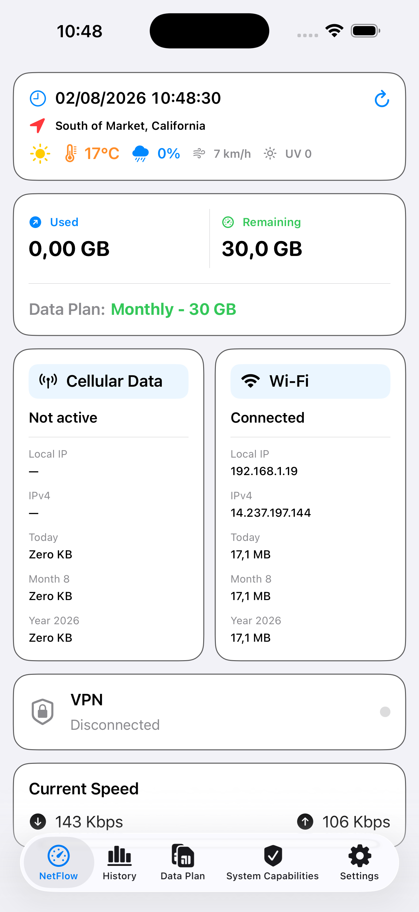
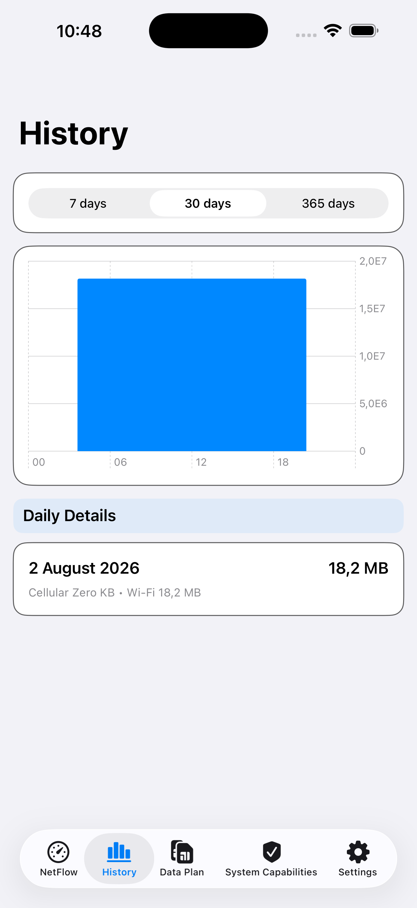
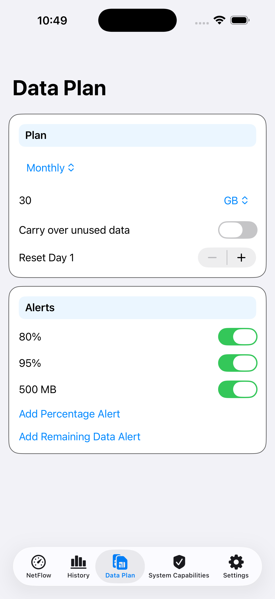
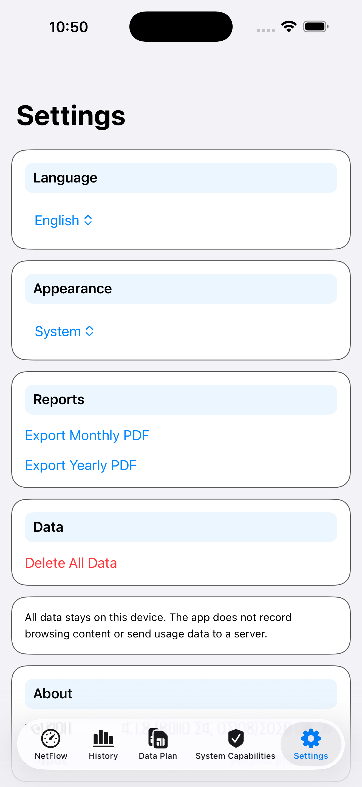
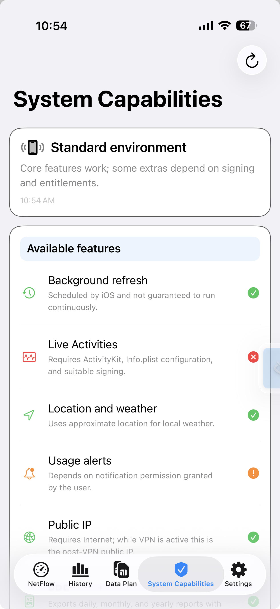

# NetFlow

> Monitor Wi‑Fi and Cellular data usage with a clean, native SwiftUI experience.

NetFlow is an open-source iPhone and iPad app for understanding network usage, managing data plans, reviewing usage history, and exporting usage reports. It is designed around Apple's native UI patterns and keeps the experience simple, readable, and privacy-conscious.

## Features

- Wi‑Fi and Cellular usage summaries
- Current connection status, local/public IP information, VPN status, and transfer speed
- Daily, monthly, and yearly usage views
- Data-plan limits with reset-day and carry-over options
- Usage alerts for percentage and remaining-data thresholds
- Monthly and yearly PDF report export
- English and Vietnamese language support
- Light, dark, and system appearance options
- Local data management with a clear-data action

## Screenshots

The screenshots below are original PNG captures supplied for NetFlow. The four Simulator captures retain their original 1320 × 2868 resolution; the System Capabilities capture retains its original 1260 × 2736 resolution. All images are referenced using repository-relative paths so they render on GitHub.

| Dashboard | History |
| --- | --- |
|  |  |

| Data Plan | Settings |
| --- | --- |
|  |  |

| System Capabilities |
| --- |
|  |

### Screenshot coverage

The current documentation package contains five screens:

- Dashboard — `docs/images/dashboard.png`
- History — `docs/images/history.png`
- Data Plan — `docs/images/plan.png`
- Settings — `docs/images/settings.png`
- System Capabilities — `docs/images/capabilities.png`

## Privacy

NetFlow is intended to keep usage information on the device. The Settings screen states that the app does not record browsing content or send usage data to a server. No account is required to use the app.

## Built with

- Swift
- SwiftUI
- Charts
- PDFKit
- Network framework
- UserNotifications
- Apple's native iOS and iPadOS APIs

## Requirements

- macOS with Xcode 15 or later
- iOS 16 or later
- A compatible iPhone, iPad, or Simulator

The exact deployment target and signing requirements are defined by the Xcode project.

## Getting started

1. Clone or download this repository.
2. Open the Xcode project or workspace.
3. Select an iPhone, iPad, or Simulator destination.
4. Select a development team if signing is required.
5. Build and run with **Product → Run** (`⌘R`).

Network and cellular values can differ between Simulator and a physical device. Use a physical iPhone when validating device-only networking behavior.

## Repository layout

```text
.
├── README.md
└── docs/
    └── images/
        ├── dashboard.png
        ├── history.png
        ├── plan.png
        ├── capabilities.png
        └── settings.png
```

## Contributing

Bug reports, documentation improvements, and focused pull requests are welcome. Please describe the device/Simulator, OS version, Xcode version, and steps to reproduce when reporting an issue.

## License

NetFlow is distributed under the license included in the repository. Keep the existing `LICENSE` file at the repository root when uploading this documentation package.
